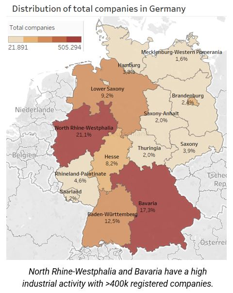

# Python_Tableau_LaborDE_Customer_expansion
This repository showcases Python syntax for data analytics (using `pandas`, `numpy`, and `os`), visualization (`matplotlib.pyplot`, `seaborn`, `scipy`), machine learning (`sklearn`), and forecasting (`statsmodels.api`) in Jupyter Notebook within Anaconda. Focused on enhancing their already successful business, LaborDE, a prominent laboratory supplier based in Nordrhein-Westphalia (NRW), Germany aims to expand their customer base not only in their stronghold of NRW but also for exploring new market opportunities in other Bundesländer.

## Project Overview

### Motivation
In 2019, the German NGO [Open Knowledge Foundation Deutschland e.V.](https://okfn.de/) and the British NGO [opencorporates](https://opencorporates.com/) collaborated to release German Trade Register data via [OffeneRegister.de](https://offeneregister.de/), offering a comprehensive list of over 5 million companies to the public. Recognizing the strategic value of this data, LaborDE aims to leverage it for identifying potential laboratory and cancer company customers in Germany.
### Objective
Address business questions posed by the LaborDE Management Board, to expand their customer base. 
#### National Landscape - Bundesland
* What is the nationwide distribution of potential customer companies specializing in laboratory diagnostics, and which Bundesländer has the highest concentration of potential customers?
* What is the prevalence of companies offering diagnostic services specifically for cancer, and where are they situated in Germany?
#### Regional Focus - NRW
* What is the distribution of potential customer companies specializing in laboratory diagnostics across NRW, and which regions exhibit the highest concentration?
* What is the extent of the customer base served by laboratory diagnostic companies in NRW in terms of male and female population?.  
### Scope
The analysis will encompass both national (Bundesländer) and regional (NRW) levels for customer base expansion.
## Dataframes overview
* The [German company dataset](https://offeneregister.de/) compiled by [OpenCorporates](https://opencorporates.com/) primarily between June 2017 and January 2019, contains basic information on over 5 million German companies.
* The demographic and financial datasets for each Bundesland and region was sourced from diverse German public websites, please refer to the [Project brief](01_2024_LaborDE_analysis/01_Project_Management/Project_brief.pdf) for details.
* The spatial data corresponded to [Bundesland](https://github.com/isellsoap/deutschlandGeoJSON/blob/main/README.md) and [regional](https://www.suche-postleitzahl.org/plz-karte-erstellen) levels and was used in Python and Tableau to create maps.  
## Python scripts
This data analysis project is organized into 7 scripts outlined below:
* [Step 1](01_2024_LaborDE_analysis/03_Scripts/Step1_LD_Project_brief_data_sources_and_cleaning.ipynb): LD Project brief, data sources, and initial data cleaning
  * Comprehensive project description, research questions, and data sources.
  * Data wrangling, cleaning and inconsistency checks.
  * Merging of German population regional dataframes.
* [Step 2](01_2024_LaborDE_analysis/03_Scripts/Step2_LD_German_company_merging.ipynb): LD Merging dataframes, Bundesland and regional
  * Merging companies and Bundesland dataframes.
  * Merging companies and regional dataframes.
* [Step 3](01_2024_LaborDE_analysis/03_Scripts/Step3_LD_Exploring_relationships_between_companies_and_Bundesland.ipynb): LD Exploring relationships between companies and Bundesland
  * Correlation, scatterplots, pairplots and categorial plots.
  * Constructing the research hypothesis.
* [Step 4](01_2024_LaborDE_analysis/03_Scripts/Step4_LD_Geographical_visualization.ipynb): LD Geographical visualization
  * Bundesland company mapping.
  * NRW company mapping.
* [Step 5](01_2024_LaborDE_analysis/03_Scripts/Step5_LD_Supervised_machine_learning_Regression.ipynb): LD Supervised Machine Learning: Regression
  * Testing the research hypothesis with a regression model.
  * Model performance evaluation.
* [Step 6](01_2024_LaborDE_analysis/03_Scripts/Step6_LD_Unsupervised_machine_learning_Clustering.ipynb): LD Unsupervised Machine Learning: Clustering
  * Clustering analysis of Bundesländer.
* [Step 7](01_2024_LaborDE_analysis/03_Scripts/Step7_LD_German_GDP_Time_series_anaylsis.ipynb): LD German GDP time-series analysis
  * Subsetting, wrangling, and cleaning time series data.
  * Decomposition, Dicker Fuller test, Autocorrelation, Stationarizing data.

ChatGPT 3.5 was used to facilitate and speed the data analysis process. 

## Tableau visuals
After conducting data analysis and running machine learning models, I utilized Tableau to create compelling visualizations that not only illustrate our findings but also provide robust support for the recommendations outlined in the customer base expansion plan. Within Tableau, I seamlessly integrated individual graphs using dashboards and story features for a comprehensive presentation. Use this [link](https://public.tableau.com/app/profile/nadia.ordonez/viz/GermancompaniesLaborDE/LaborDECustomerexpansion) to access the dashboard.

## Data-driven recommendations for Customer base expansion 
Stakekholders are informed about our main Python findings in the [Word report](01_2024_LaborDE_analysis/05_Send_to_client/Data_driven_recommendations.pdf). The below recommendations are supported by our data analysis process.
* Expanding Business to Bavaria. 
Bavaria has a considerable number of potential laboratory and cancer-related companies. The region's impressive attributes, including a robust GDP and substantial population, make it an enticing prospect for business expansion. Alternatively, consider Baden-Württemberg as another promising Bundesland for business growth. It exhibits similarities to Bavaria, offering a fertile ground for expansion.to meet their preferences can further enhance our market share.
* Expanding our Local Customer Base.
Based on the recently released data on registered German companies, 2112 potential laboratory companies and 267 cancer-related companies were identified in NRW. These entities, if not already engaged with our client, LaborDE, present excellent opportunities for us to introduce and promote our diverse product portfolios. The customer base of our customer companies in NRW highlights a slight female-centric focus, making it compelling to expand our offerings with a higher quantity of cancer-related diagnostic products tailored to women's health.
                                                                         
## Project timeline
This data analysis project was completed within 12 days, using Python for data analysis and visualization, alongside Tableau and Word for stakeholder reporting. 
